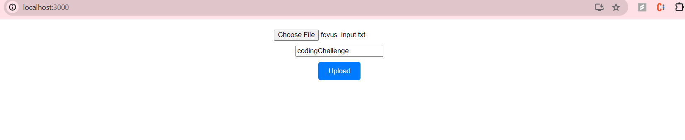

Certainly! Here's a more formatted and readable version of the README:

---

# Fovus_Cloud_Project

Cloud project for Fovus Coding Challenge Summer Intern 

## Backend AWS Cloud Implementation

### Steps Performed

1. **Upload File to S3**: Files are uploaded from the client browser to an S3 bucket using Pre-signed URLs.
   
2. **API Gateway Integration**: Upon successful upload to S3, an API Gateway with a POST method is called to upload the file path and input text content to DynamoDB via a Lambda function (Function name: `uploadHandler`).
   
3. **DynamoDB Streams**: Records insertion into DynamoDB triggers an event. DynamoDB streams and triggers are set from the DynamoDB CDK stack.
   
4. **Trigger Lambda Function**: Another Lambda function (`ec2Launch`) is triggered.
   
5. **Create EC2 Instance**: The `ec2Launch` Lambda function creates an EC2 instance from a custom AMI Image Id.
   
6. **Download and Execute Script**: The EC2 instance downloads a Python script from an S3 bucket and executes it. This setup involves creating a systemctl service, creating a shell script file, and then creating an AMI image of that instance.
   
7. **Script Actions**:
    - Retrieve inputs from DynamoDB FileTable by id.
    - Download the input file from S3 (`[BucketName]/[InputFile].txt`) to the VM.
    - Append the retrieved input text to the downloaded input file and save it.
    - Upload the output file to S3.
    - Save the outputs and S3 path in DynamoDB FileTable.
   
8. **Shutdown EC2**: Finally, the EC2 instance is shut down.

## Project Folder Structure

```
fovus-project-cdk-v2
│   README.md
└───lib
│   │   fovus-project-cdk-V2-Stack.ts (Entry Stack to orchestrate all the stacks)
│   │   fovus-project-api-gateway-stack.ts (Stack for API Gateway)
│   │   fovus-project-s3-stack.ts (Stack for S3)
│   │   fovus-project-dynomoDB-stack.ts (Stack for DynamoDB)
└───scripts
│   │   script.py (Python script which will be uploaded to S3 and perform Step 7)
└───assets
    └───lambda
        │   uploadHandler.zip (Lambda for uploading input text and S3 path to DynamoDB)
        │   ec2Launch.zip (Lambda for booting up EC2 instance)
```

## Results


These are the output images stored in results folder

React Application


Initial S3 Bucket


Client Input



Input File Content


OutPut File Content


Final S3 Bucket 


---

